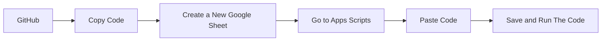

# Limits

A good way to learn is to practice. Understanding the statistics involve in **Data Analysis and Econometrics** is a vital part for learning. Hence, I created statistics calculator add on that allows economist  and data analyst to carry out statistical analysis on google sheets. Right now the the addon can do things a simple a **mean, median mode,** to more complex operations like multiple **linear regression.**

The Inspiration for this project was to recreate a desktop application called **EViews**. 

**EViews** is a statistical package for Windows, used mainly for time-series oriented econometric analysis. It is developed by Quantitative Micro Software, now a part of IHS.

## What can it do?
For now,
 1. it can calculate the summary of your data with the Descriptive statistics functions such as:
	 - Mean 
	 - Sum 
	 - Minimum 
	 - Maximum 
	 - Observation 
	 - Median 
	 - Standard Deviation 
	 - Skewness 
	 - Kurtosis 
	 - Sum of Squares 
	 - Jarque -Bera

 2. It can also find the correlation between multiple variables. That is 
	 -  Multiple Correlation

 3. It can also calculate linear multiple regression.
	 - Multiple Regression

***To see the implementation, check out this [Google sheet](https://docs.google.com/spreadsheets/d/1Jeb0HK7usLIUjxXinogwNm6lENWkpIEqeCJ1pROOyYk/edit?usp=copy).***

# Guide For Using Limits

## Setup
There are 2 way to set up limit on a sheet.
1. Make a copy of this [Google sheet](https://docs.google.com/spreadsheets/d/1Jeb0HK7usLIUjxXinogwNm6lENWkpIEqeCJ1pROOyYk/edit?usp=copy). When that is done, the sheet would contain all the functions stated above.
2. Go to [GitHub](https://github.com/Hemephelus/Data-Analyst/tree/main/Data%20Analysis%20Projects/Limits), make a copy of the code, create a new google sheet, go to apps scripts and paste the code there. After that,  save and run the code. **This would be done only once**, after that, the sheet would contain all the functions stated above.

## How it works	
Like every other function in google sheets, you can write the same functions in a cell by starting with an "=" sign and the function name.

Example: Multiple Regression

    =MULTREG('Data Set'!B3:G42,1)
	 //Returns the coefficients of all the independent vairables
    =MULTREG(Array,  Depdt_Var_Col_Num)

**Array**
	    The range of cells to calculate.
    **Depdt_Var_Col_Num**
	    The value or cell that would be the dependent variable.
